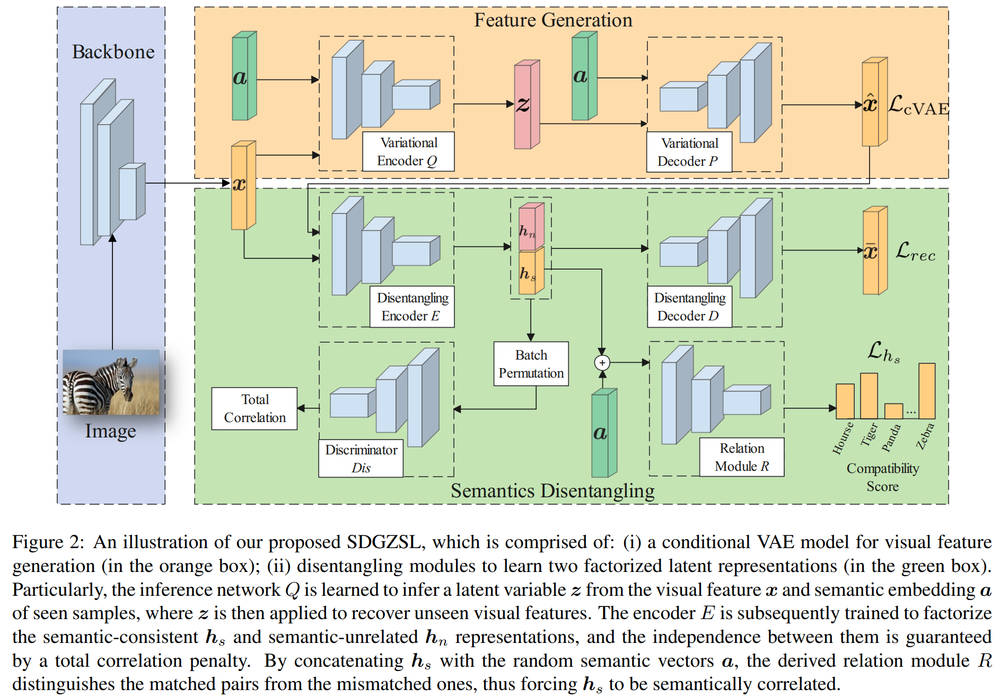

# Semantics Disentangling for Generalized Zero-Shot Learning 

This is the official implementation for paper 
> Zhi Chen, Yadan Luo, Ruihong Qiu, Zi Huang, Jingjing Li, Zheng Zhang.  
**Semantics Disentangling for Generalized Zero-Shot Learning**  
_International Conference on Computer Vision (ICCV) 2021_.

[Semantics Disentangling for Generalized Zero-shot Learning](https://arxiv.org/pdf/2101.07978.pdf)



Abstract: Generalized zero-shot learning (GZSL) aims to classify samples under the assumption that some classes are not 
observable during training. To bridge the gap between the seen and unseen classes, most GZSL methods attempt to associate 
the visual features of seen classes with attributes or to generate unseen samples directly. Nevertheless, the visual 
features used in the prior approaches do not necessarily encode semantically related information that the shared 
attributes refer to, which degrades the model generalization to unseen classes. To address this issue, in this paper, 
we propose a novel semantics disentangling framework for the generalized zero-shot learning task (SDGZSL), where the 
visual features of unseen classes are firstly estimated by a conditional VAE and then factorized into semantic-consistent 
and semantic-unrelated latent vectors. In particular, a total correlation penalty is applied to guarantee the independence 
between the two factorized representations, and the semantic consistency of which is measured by the derived relation 
network. Extensive experiments conducted on four GZSL benchmark datasets have evidenced that the semantic-consistent 
features disentangled by the proposed SDGZSL are more generalizable in tasks of canonical and generalized zero-shot 
learning. 

------------------------------
Supplementary Experimental Results

### In the paper, we followed the datasets provided in [15], in which the visual features in FLO dataset are normalized, and the semantic description of CUB dataset is the CNN-RNN sentence embeddings (1024D). We hereby provide extra comparison results on the visual features provided by GBU setting [17]. 

| Model      | AwA2 T1 |    u    |    s    |    H    | aPY T1  |    u    |    s    |    H    |CUB-EMB T1|  u     |    s    |    H    |CUB-ATT T1|   u    |    s    |    H    | 
|------------|---------|---------|---------|---------|---------|---------|---------|---------|---------|---------|---------|---------|---------|---------|---------|---------|
| LFGAA [4]  |   68.1  |   27.0  |   93.4  |   41.9  |    -    |    -    |     -   |    -    |     -   |   -     |   -     |   -     |  67.6   |   36.2  |   80.9  |   50.0  |
| DVBE [7]   |   -     |   63.6  |   70.8  |   67.0  |   -     |   32.6  |   58.3  |   41.8  |     -   |   -     |   -     |   -     |  -      |   53.2  |   60.2  |   56.5  |
| DVBE* [7]  |   -     |   62.7  |   77.5  |   69.4  |   -     |   37.9  |   55.9  |   45.2  |     -   |   -     |   -     |   -     |  -      |   64.4  |   73.2  |   68.5  |
|f-CLS WGAN[1]|  65.3  |   56.1  |   65.5  |   60.4  |   40.5  |   32.9  |   61.7  |   -     |     -   |   50.3  |  58.3   |   54.0  |  57.3   |   43.7  |   57.7  |   49.7  |
| CANZSL[8]  |   68.9  |   49.7  |   70.2  |   58.2  |   -     |    -    |     -   |    -    |     -   |   -     |   -     |   -     |  60.6   |   47.9  |   58.1  |   52.5  |
| LisGAN [9] |   70.6  |   52.6  |   76.3  |   62.3  |   43.1  |   34.3  |   68.2  |   45.7  |     -   |   -     |   -     |   -     |  58.8   |   46.5  |   57.9  |   51.6  |
|CADA-VAE[10]|   64.0  |   55.8  |   75.0  |   63.9  |   -     |   31.7  |   55.1  |   40.3  |     -   |   52.0  |   54.8  |   53.4  |  61.8   |   51.6  |   53.5  |   52.4  |
|f-VAEGAN-D2[11]|  71.1|   57.6  |   70.6  |   63.5  |   -     |    -    |     -   |    -    |     -   |   -     |   -     |   -     |  61.0   |   48.4  |   60.1  |   53.6  |
|f-VAEGAN-D2*[11]| 70.3|   57.1  |   76.1  |   65.2  |   -     |    -    |     -   |    -    |     -   |   -     |   -     |   -     |  72.9   |   63.2  |   75.6  |   68.9  |
| DLFZRL [12]|   70.3  |    -    |     -   |   60.9  |   46.7  |    -    |     -   |    38.5 |     -   |   -     |   -     |   -     |  61.8   |   -     |   -     |   51.9  |
|TF-VAEGAN [13]| 72.2  |   59.8  |    75.1 |   66.6  |   -     |    -    |     -   |    -    |     -   |   -     |   -     |   -     |  64.9   |   52.8  |   64.7  |   58.1  |
|TF-VAEGAN*[13]| 73.4  |   55.5  |    83.6 |   66.7  |   -     |    -    |     -   |    -    |     -   |   -     |   -     |   -     |  74.3   |   63.8  |   79.3  |   70.7  |
| E-PGN [15] | 73.4    |   52.6  |    83.5 |   64.6  |   -     |    -    |     -   |    -    |     72.4|   52.0  |   61.1  |   56.2  |   -     |   -     |   -     |   -     |
| AGZSL [16] | 73.8    |   65.1  |    78.9 |   71.3  |   41.0  |    35.1 |   65.5  |    45.7 |     -   |   -     |   -     |   -     |  57.2   |   41.4  |   49.7  |   45.2  |
| AGZSL*[16] | 76.4    |   52.6  |    86.5 |   76.8  |   43.7  |    36.2 |   58.6  |    44.8 |     -   |   -     |   -     |   -     |  77.2   |   69.2  |   76.4  |   72.6  |
| SDGZSL     | 72.1    |   64.6  |    73.6 |   68.8  |   45.4  |    38.0 |   57.4  |    45.7 |    75.5 |   59.9  |   66.4  |   63.0  |  62.8   |   51.5  |   58.7  |   54.9  |
| SDGZSL*    | 74.3    |   69.6  |    86.5 |   73.7  |   47.0  |    36.2 |   60.7  |    47.5 |    78.5 |   73.0  |   77.5  |   75.1  |  73.7   |   66.0  |   75.9  |   70.6  |


| Model      |FLO-GBU T1|    u   |    s    |    H    |FLO-EPGN T1|    u  |    s    |    H    |  SUN T1 |    u    |    s    |    H    |
|------------|---------|---------|---------|---------|---------|---------|---------|---------|---------|---------|---------|---------|
| LFGAA [4]  |    -    |    -    |     -   |    -    |    -    |    -    |     -   |    -    | 61.5    |   18.5  |   40.0  |   25.3  |
| DVBE [7]   |    -    |    -    |     -   |    -    |    -    |    -    |     -   |    -    | -       |   45.0  |   37.2  |   40.7  | 
| DVBE* [7]  |    -    |    -    |     -   |    -    |    -    |    -    |     -   |    -    | -       |   44.1  |   41.6  |   42.8  | 
|f-CLSWGAN[1]|   67.2  |   59.0  |   73.8  |   65.6  |    -    |    -    |     -   |    -    | 60.8    |   42.6  |   36.6  |   39.4  |
| CANZSL[8]  |   69.7  |   58.2  |   77.6  |   66.5  |    -    |    -    |     -   |    -    | 60.1    |   46.8  |   35.0  |   40.0  |
| LisGAN [9] |   69.6  |   57.7  |   83.8  |   68.3  |    -    |    -    |     -   |    -    | 61.7    |   42.9  |   37.8  |   40.2  |
|CADA-VAE[10]|   65.2  |   51.6  |   75.6  |   61.3  |    -    |    -    |     -   |    -    | 61.8    |   47.2  |   35.7  |   40.6  |
|f-VAEGAN-D2[11]| 67.7 |   56.8  |   74.9  |   64.6  |    -    |    -    |     -   |    -    | 64.7    |   45.1  |   38.0  |   41.3  |
|f-VAEGAN-D2*[11]| 70.4|   63.3  |   92.4  |   75.1  |    -    |    -    |     -   |    -    | 65.6    |   50.1  |   37.8  |   43.1  |
| DLFZRL [12]|   -     |    -    |     -   |   -     |    -    |    -    |     -   |    -    | 61.3    |   -     |   -     |   42.5  |
|TF-VAEGAN [13]| 70.8  |   62.5  |   84.1  |   71.7  |   -     |    -    |     -   |    -    | 66.0    |   45.6  |   40.7  |   43.0  |
|TF-VAEGAN*[13]| 74.7  |   63.8  |   92.5  |   79.4  |   -     |    -    |     -   |    -    | 66.7    |   41.8  |   51.9  |   46.3  |
| E-PGN [15] |   -     |   -     |   -     |   -     |   85.7  |    71.5 |   82.2  |    76.5 | -       |   -     |   -     |   -     |
| AGZSL [16] |   -     |   -     |   -     |   -     |   82.7  |    63.5 |   94.0  |    75.7 | 63.3    |   29.9  |   40.2  |   34.3  |
| AGZSL*[16] |   -     |   -     |   -     |   -     |   86.9  |    73.7 |   91.9  |    81.7 | 66.2    |   50.5  |   43.1  |   46.5  |
| SDGZSL     |   73.3  |   62.2  |   79.3  |   69.8  |   85.4  |    83.3 |   90.2  |    86.6 | 62.4    |   48.2  |   36.1  |   41.3  |
| SDGZSL*    |   76.6  |   73.2  |   88.7  |   80.2  |   86.9  |    86.1 |   89.1  |    87.8 | 65.2    |   51.1  |   40.2  |   45.0  |

69.36 61.62 79.32


## TODO
- <del> Results on CUB with attributes </del>
- <del> Results on FLO without normalization </del>
- <del> Results on SUN </del>
- Release the code of supplementary experiments
## Requirements
The implementation runs on

- Python 3.6

- torch 1.3.1

- Numpy

- Sklearn

- Scipy

## Usage

Put your [datasets](https://drive.google.com/file/d/1KxFC6T_kGKCNx1JyX2FOaSimA0DOcU_I/view?usp=sharing) in SDGZSL_data folder and run the scripts:

The extracted features for APY and AWA datasets are from [[1]](https://www.mpi-inf.mpg.de/departments/computer-vision-and-machine-learning/research/zero-shot-learning/feature-generating-networks-for-zero-shot-learning), 
FLO and CUB datasets are from [[2]](https://github.com/yunlongyu/EPGN). For the fine-tuned features, AWA,FLO and CUB are from [[3]](https://github.com/akshitac8/tfvaegan). 
The APY fine-tuned features are extracted from us.

[1] Xian, Yongqin, et al. "Feature generating networks for zero-shot learning." CVPR 2018.

[2] Yu, Yunlong, et al. "Episode-based prototype generating network for zero-shot learning." CVPR 2020.

[3] Narayan, Sanath, et al. "Latent embedding feedback and discriminative features for zero-shot classification." ECCV 2020.

[4] Y. Liu, et al. "Attribute attention for semantic disambiguation in zero-shot learning."  CVPR 2019.

[7] S. Min, et al. "Domain-aware visual bias eliminating for generalized zeroshot learning." CVPR 2020.

[8] Z. Chen, et al, "CANZSL: Cycleconsistent adversarial networks for zero-shot learning from natural language,"  WACV, 2020.

[9] J. Li, et al. "Leveraging the invariant side of generative zero-shot learning." CVPR, 2019.

[10] E. Schonfeld, et al. "Generalized zero-and few-shot learning via aligned variational autoencoders." CVPR, 2019.

[11] Y. Xian, et al. "f-vaegan-d2:A feature generating framework for any-shot learning." CVPR, 2019.

[12] B. Tong, et al. "Hierarchical disentanglement of discriminative latent features for zero-shot learning." CVPR, 2019.

[13] S. Narayan, et al. "Latent embedding feedback and discriminative features for zero-shot classification." ECCV, 2020.

[15] Y. Yu, et al. "Episode-based prototype generating network for zero-shot learning." CVPR, 2020.

[16] C., Yu-Ying, et al. "Adaptive and generative zero-shot learning." ICLR, 2020.

[17 ] Y. Xian, et al. "Zero-shot learning—a comprehensive evaluation of the good, the bad and the ugly." TPAMI, 2018.

## Citation:
If you find this useful, please cite our work as follows:
```
@inproceedings{chen2021semantics,
	title={Semantics Disentangling for Generalized Zero-shot Learning},
	author={Chen, Zhi and Luo, Yadan and Qiu, Ruihong and Huang, Zi and Li, Jingjing and Zhang, Zheng},
	booktitle={ICCV},
	year={2021}
}
```
